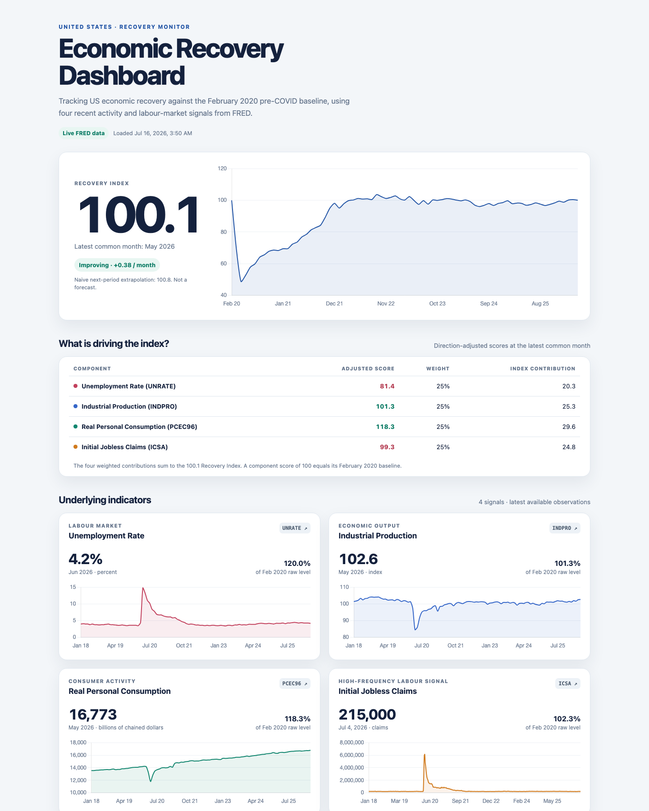

# US Economic Recovery Dashboard

## 1. What it does

This prototype pulls four United States economic series from FRED, shows their latest values and history, and combines them into one baseline-relative Recovery Index. The dashboard is a deliberately small end-to-end slice: FastAPI retrieves and transforms real data, JSON endpoints expose the results, and a server-rendered Jinja page uses Chart.js for the visual layer. It supports the official FRED REST API when an optional server-side key is configured, while remaining runnable through FRED's public CSV service when no key is available. A 12-hour in-memory cache avoids repeated calls, downloaded snapshots provide an offline fallback, and a clearly labelled six-month linear extrapolation provides a lightweight direction signal rather than a forecast.



### Exercise coverage

| What the exercise asks for | Where it is delivered |
|---|---|
| One country and a coherent handful of indicators | United States; labour, output, consumption, and high-frequency claims |
| Direct linkage to a public/live source | Official FRED REST API with a configured key; public FRED CSV otherwise |
| Recent values and visualisation | Four latest-value cards with native-frequency Chart.js histories |
| Logic for measuring recovery | Auditable February 2020-normalised, direction-adjusted weighted index |
| Locally running prototype | FastAPI/Jinja application started with one Uvicorn command |
| Decisions and trade-offs | Sections 3–9 below, including frequency alignment and limitations |

The scope is intentionally narrow: it completes the full data → transformation → API → dashboard path within the exercise's 3–4 hour framing instead of presenting a larger unfinished platform.

## 2. How to run

Python 3.11 or newer is required.

```bash
# From the recovery-dashboard directory
python3 -m venv .venv
source .venv/bin/activate
pip install -r requirements.txt
```

No account, API key, or `.env` file is required for the default public-CSV mode. Start the application with one command:

```bash
uvicorn app.main:app --reload
```

Open [http://localhost:8000](http://localhost:8000). FastAPI's interactive API documentation is available at [http://localhost:8000/docs](http://localhost:8000/docs).

### Optional official FRED REST mode

If a FRED API key is available, copy the example environment file and add it there:

```bash
cp .env.example .env
```

```dotenv
FRED_API_KEY=your_key_here
```

Keys can be requested from FRED's [API key page](https://fred.stlouisfed.org/docs/api/api_key.html). Restart Uvicorn after changing `.env`. The key is read only by the Python server, is excluded by `.gitignore`, is never returned by an endpoint, and must not be pasted into the dashboard. It authenticates access to FRED; it does not choose the indicators or calculate relevance. Those decisions remain explicit in `app/indicators.py` so the methodology is reviewable.

The endpoints are:

- `GET /` — dashboard page.
- `GET /api/indicators` — latest and baseline values, raw baseline percentages, and native-frequency chart series.
- `GET /api/recovery-index` — current composite, monthly history, indicator contributions, and the naive trend.
- `GET /health` — source-independent liveness check returning `{"status": "ok"}`.

On each cache refresh, the application follows a resilient priority chain:

1. Official FRED REST observations API when `FRED_API_KEY` is configured.
2. FRED's public graph CSV download when no key exists or the REST request fails.
3. Downloaded files in `data/` if neither live route is available.

A clear `503` JSON error is returned only if all applicable sources fail. Both JSON endpoints expose `data_status`, and the dashboard labels the result as REST API, public CSV, snapshot, or mixed so fallback data is never presented as live. This provides the API-key workflow requested in the build brief without making the existing keyless demonstration dependent on FRED account access.

## 3. Country & shock

The prototype focuses on the **United States** because FRED provides a coherent, frequently updated set of labour, output, and consumption series through one stable public data service. **February 2020** is the fixed pre-COVID shock baseline: it is the last full month before the broad US disruption in March 2020. Every component equals 100 at that baseline, making later readings easy to interpret against pre-shock conditions.

This is a monitoring baseline, not a causal estimate of what the economy would have done without COVID. It does not remove long-run growth, revisions, seasonality beyond that already present in the selected FRED series, or other shocks after 2020.

## 4. Indicator choice

The four series cover distinct but complementary parts of the recovery story while staying small enough to explain:

| FRED series | Category | Frequency | Direction | Why it is included |
|---|---|---:|---|---|
| [`UNRATE`](https://fred.stlouisfed.org/series/UNRATE) | Labour market | Monthly | Lower is better | Seasonally adjusted U-3 unemployment captures labour-market slack and household employment conditions. |
| [`INDPRO`](https://fred.stlouisfed.org/series/INDPRO) | Economic output | Monthly | Higher is better | The seasonally adjusted real-output index covers manufacturing, mining, and electric and gas utilities. |
| [`PCEC96`](https://fred.stlouisfed.org/series/PCEC96) | Consumer activity | Monthly | Higher is better | Real, seasonally adjusted personal consumption captures household demand while removing price-level effects. |
| [`ICSA`](https://fred.stlouisfed.org/series/ICSA) | High-frequency labour signal | Weekly | Lower is better | Seasonally adjusted initial claims respond quickly to layoffs and provide the most current stress signal. |

Together they cover labour conditions, production, consumer demand, and a weekly turning-point signal. GDP was intentionally not included because its quarterly release frequency would make the common composite less timely.

## 5. Recovery Index design

For each indicator (i), let (x_{i,t}) be its value in month (t), and let (b_i) be its February 2020 value. For weekly ICSA, both the baseline and composite values are calendar-month averages as described in the next section.

For **higher-is-better** indicators (`INDPRO`, `PCEC96`):

```text
adjusted_score(i, t) = (x(i, t) / b(i)) × 100
```

For **lower-is-better** indicators (`UNRATE`, `ICSA`), the ratio is inverted so an improvement always raises the score:

```text
adjusted_score(i, t) = (b(i) / x(i, t)) × 100
```

The composite is a weighted arithmetic mean:

```text
Recovery Index(t) = Σ(weight(i) × adjusted_score(i, t)) / Σ(weight(i))
```

All four weights are configuration constants in `app/indicators.py` and default to `0.25`. Equal weights are transparent and defensible for a prototype; they do **not** assert that the indicators have equal economic importance.

- **100** — conditions match February 2020 on this indicator mix.
- **Below 100** — the mix is weaker than the pre-shock baseline.
- **Above 100** — the mix exceeds the baseline after direction adjustment.

The indicator cards show the **raw** `current / baseline × 100` ratio so the user can see the original series movement. The recovery endpoint separately exposes each direction-adjusted score and weighted contribution, making the composite auditable.

The dashboard also renders those scores and contributions in a driver table. This is important because a composite can hide offsetting movements—for example, stronger consumption can coexist with weaker unemployment performance even when the headline index is near 100.

The optional trend uses `numpy.polyfit(..., degree=1)` over the last six common monthly index points. Its slope labels the index as improving, declining, or stable and extrapolates one period. It is explicitly a naive linear extrapolation—not a forecast or policy recommendation.

## 6. Frequency handling

FRED's native weekly ICSA observations are retained for the indicator card and `/api/indicators`. For the Recovery Index, observations are grouped by calendar month and replaced with their arithmetic mean:

```text
ICSA_month = mean(all weekly ICSA observations dated within that month)
```

The February 2020 ICSA baseline is therefore the February calendar-month average, not one arbitrarily selected week. The three monthly series and monthly ICSA are aligned using the **intersection of available months**. No value is forward-filled. Consequently, the current composite date is the latest month for which all four indicators are present; it can lag the latest native weekly ICSA observation. This favors a comparable, complete index over a superficially fresher one containing stale components.

## 7. Trade-offs & assumptions

- **One country and four indicators:** enough breadth to tell a coherent recovery story without turning the exercise into a data-platform project.
- **No database or distributed cache:** live FRED observations are held in a process-local dictionary for 12 hours. Restarting the process clears the memory cache, and multiple workers would have independent caches; both are acceptable for a local prototype.
- **Optional API authentication:** the official FRED REST route is preferred when a key is configured. Public CSV remains a deliberate compatibility path for reviewers who cannot create or use a FRED account; both routes use the same chosen FRED series.
- **Downloaded fallback data:** `data/*.csv` keeps the demonstration functional during a FRED/network outage. These snapshots can become stale, so configured live FRED routes are always attempted first after the cache expires.
- **No authentication, Docker, or frontend framework:** these would add setup and code without strengthening the evaluated end-to-end data slice.
- **Equal weights and fixed baseline:** transparent and easy to audit, but not empirically estimated. The reciprocal lower-is-better formula can become very large as a value approaches zero, though neither selected series is normally near zero.
- **Latest revised data:** the dashboard asks FRED for the current observation history, not historical data vintages. Results can change when source agencies revise series.
- **No forward filling:** the composite stops at the latest shared month. This avoids mixing release dates at the cost of some timeliness.
- **No real forecasting:** six-point linear extrapolation is a presentation bonus only. It omits uncertainty, seasonality, regime shifts, and causal structure.
- **Chart.js via CDN:** keeps the repository small, but charts require browser internet access even when FRED results are cached.

The client requests observations from `2018-01-01`, filters FRED's `"."` missing-value marker plus malformed/non-finite values, and times out upstream requests after 15 seconds.

## 8. What I'd build next

- Add leading signals such as real retail sales, business formation, mobility, or financial conditions, then estimate and sensitivity-test weights.
- Make country, shock date, and indicator sets configurable, using OECD/World Bank adapters for countries not covered coherently by FRED.
- Replace the extrapolation with a validated nowcasting model that handles mixed release calendars, revisions, uncertainty intervals, and backtesting.
- Deploy with persistent/shared caching, scheduled refreshes, data-quality monitoring, and a clear “last successfully updated” status.

## 9. Methodology note / references

The baseline-relative framing is inspired by real-time trackers that compare observed activity with a no-shock reference. The [OECD Weekly Tracker](https://www.oecd.org/en/publications/oecd-economic-outlook/volume-2020/issue-2_39a88ab1-en/full-report/issue-note-1-the-oecd-weekly-tracker-of-activity-based-on-google-trends_f0706f14.html), for example, estimates activity relative to a no-pandemic counterfactual. This prototype is intentionally simpler: it uses one observed February 2020 level rather than estimating a counterfactual path.

The normalize → orient direction → weight → aggregate structure follows standard composite-index practice and is conceptually similar to the [COVID Economic Recovery Index methodology](https://www.covidrecoveryindex.org/methodology). The reference motivates a composite recovery view; this dashboard does not reproduce its much broader country-resilience model.

The [OECD/JRC Handbook on Constructing Composite Indicators](https://www.oecd.org/en/publications/handbook-on-constructing-composite-indicators-methodology-and-user-guide_9789264043466-en.html) motivates the explicit theoretical scope, normalisation, weighting, aggregation, and transparent access to underlying components used here. This prototype does not claim the statistical validation expected of a production policy index.

The authenticated [FRED REST observations API](https://fred.stlouisfed.org/docs/api/fred/series_observations.html) requires a registered key. The client uses that endpoint when `FRED_API_KEY` is configured and otherwise uses FRED's public graph CSV download; for example, [UNRATE as CSV](https://fred.stlouisfed.org/graph/fredgraph.csv?id=UNRATE&cosd=2018-01-01). The same configured FRED series IDs and current revised observations are used in either mode. FRED supplies the data but does not endorse this index or its interpretation.

## Project structure

```text
recovery-dashboard/
├── app/
│   ├── __init__.py
│   ├── main.py
│   ├── fred_client.py
│   ├── indicators.py
│   ├── recovery.py
│   └── templates/
│       └── index.html
├── data/
│   ├── UNRATE.csv
│   ├── INDPRO.csv
│   ├── PCEC96.csv
│   └── ICSA.csv
├── docs/
│   └── dashboard.png
├── tests/
│   ├── test_fred_client.py
│   ├── test_recovery.py
│   └── test_routes.py
├── requirements.txt
├── .env.example
├── .gitignore
└── README.md
```

## Tests

The tests use Python's standard-library `unittest` plus `httpx.MockTransport`; no extra test dependency is required.

```bash
python -m unittest discover -s tests -v
```

They cover normalization direction, weekly-to-monthly alignment, equal-weight aggregation, native-frequency indicator output, trend calculation, authenticated REST parsing, missing-value filtering, REST-to-CSV fallback, cache reuse, downloaded-snapshot fallback, secret-safe source errors, and the HTTP routes.
